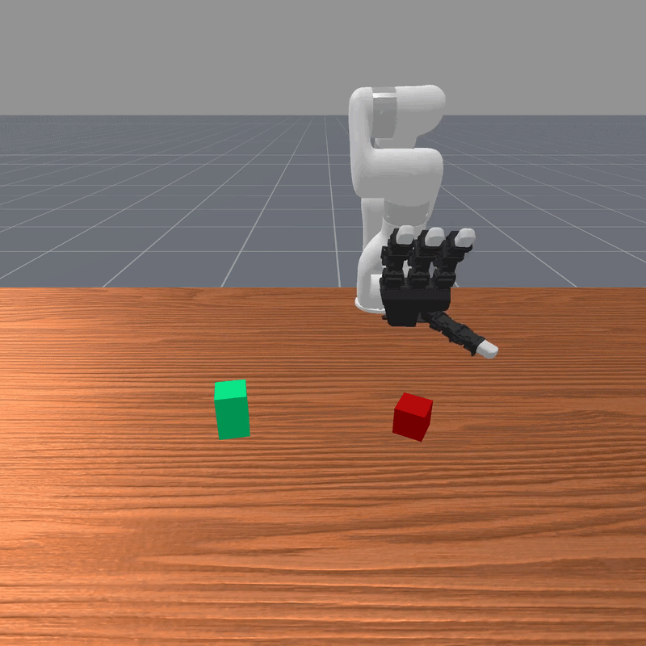

# HANDFUL: Sequential Grasp-Conditioned Dexterous Manipulation with Resource Awareness

<p align="center">
  
  
</p>


## Table of Contents
- [Overview](#overview)
- [Installation](#installation)
- [Core Architecture & Files](#core-architecture--files)
- [Training Pipeline](#training-pipeline)
- [Grasp State Reusability](#grasp-state-reusability)
- [Baselines and Ablations](#baselines-and-ablations)
- [HANDFUL-Bench](#handful-bench)
- [License](#license)

---

## Overview

This repository contains the implementation code of **HANDFUL: Sequential Grasp-Conditioned Dexterous Manipulation with Resource Awareness** ([Paper](https://arxiv.org/abs/2604.25126), [Website](https://handful-dex.github.io/)) by Ethan Foong*, Yunshuang Li*, Hao Jiang, Gaurav S. Sukhatme, and Daniel Seita at the [Robotic Embedded Systems Lab](https://uscresl.org/) and the [SLURM Lab](https://slurm-lab-usc.github.io/). HANDFUL presents a unified benchmark and training pipeline for executing sequence-based multi-finger dexterous manipulation tasks utilizing the ManiSkill 3 simulator.

HANDFUL decomposes long-horizon dexterous manipulation into three sequential phases:
1. **Grasp Training**: Learning robust pick and grasp policies for various finger configurations.
2. **State Collection & Filtering**: Executing rollouts of the grasp policy, filtering successful trajectories, and saving their final states.
3. **Curriculum learning / Second Task Training**: Progressively scaling the task difficulty for the second task policies (initialized from successful grasp states) to master the final task (e.g., pushing, knob-twisting, button-pressing).

---

## Installation

HANDFUL requires Python 3.10 and ManiSkill 3.

### 1. Conda Environment Setup
```bash
conda create -n handful python=3.10
conda activate handful
```

### 2. ManiSkill 3 and PyTorch Installation

HANDFUL uses ManiSkill as its core robotics simulator. Installation of ManiSkill is extremely simple, you only need to run a few pip installs and setup Vulkan for rendering.

```bash
# Install the package
pip install --upgrade mani_skill
# Install PyTorch
pip install torch
```

Finally you also need to set up Vulkan with [instructions here](https://maniskill.readthedocs.io/en/latest/user_guide/getting_started/installation.html#vulkan)

For more details about installation (e.g. from source, or doing troubleshooting) see [the documentation](https://maniskill.readthedocs.io/en/latest/user_guide/getting_started/installation.html
)

### 3. HANDFUL Clone & Requirements

```bash
git clone https://github.com/handful-dex/HANDFUL.git
cd HANDFUL/
pip install -r requirements.txt
cd HANDFUL/
```

---

## Core Architecture & Files

The training and evaluation pipeline is composed of the following key scripts (in the HANDFUL/HANDFUL/ directory):

*   **`train_picking.py`**: Handles the initial training of resource aware grasping policies. 
*   **`transition_feasibility/collect_intermediate_states.py`**: Executes evaluation rollouts of the trained grasp policy, evaluates the success rate of each grasp type, and extracts the final simulation states (joint positions, object poses, active fingers) into `.pt` file pools in the intermediate_states folder.
*   **`curriculum/curriculum_train.py`**: Manages the progressive multi-stage curriculum training of the secondary manipulation task starting from the loaded grasp states.
*   **`transition_feasibility/success_labeler.py`**: Success rate evaluator that runs a trained second-task policy from the saved grasp states to evaluate success rate of second task policies.

---

## Training Pipeline

The standard end-to-end curriculum pipeline is orchestrated using `run_pipeline.py`. To run the full Multi-Grasp Curriculum training:

```bash
cd HANDFUL/HANDFUL/
python run_pipeline.py --mode curriculum --second_task_env xArm7-v1-push
```

Running this command executes the three phases automatically:
1. **Phase 1**: Trains grasp policies using `train_picking.py` for multiple hand configurations.
2. **Phase 2**: Evaluates grasp checkpoints, filters successful trajectories, and saves stable states into `intermediate_states/` via `collect_intermediate_states.py`.
3. **Phase 3**: Runs the multi-stage curriculum using `curriculum/curriculum_train.py` to train the given second subtask skill starting from the saved grasp configurations.

---

## Grasp State Reusability

One of the key design patterns in HANDFUL is the modularity and **reusability** of intermediate states. Grasp training and state collection only need to be executed once (unless you are unhapy with the learned grasps). Once successful states are saved under `intermediate_states/`, they can be reused directly to train any number of new secondary tasks without re-running Phase 1 and Phase 2.

To train a new task directly using pre-collected states:
1. Open `curriculum/curriculum_train.py`.
2. Configure your target task and state paths at the top of the file:
   ```python
   ENV_ID = "xArm7-v1-press-button"  # The new secondary task environment
   
   STATE_CONFIGS = [
       "intermediate_states/fingers_3_0_1_2_active_2_palm_False_seed_10/grasp_to_push.pt",
       "intermediate_states/fingers_3_2_0_1_active_2_palm_False_seed_10/grasp_to_push.pt",
       # Add additional collected states to the pool...
   ]
   ```
3. Run the curriculum training script directly:
   ```bash
   python curriculum/curriculum_train.py --seed 10
   ```

You may also train grasps and save their states to `intermediate_states/` by first training a grasp checkpoint using `train_picking.py` and then using `collect_intermediate_states.py` to collect the successful end states of each grasp type (this can be helpful if one of the initial grasp types fails during training).

---

## Baselines and Ablations

We support alternative modes of training to evaluate and ablate the components of HANDFUL.

*Note: Since the **No Curriculum** and **Unified** pipelines do not prune underperforming configurations, they can take longer to train. You may want to limit training to a single grasp configuration using the `--grasps` argument (e.g. `--grasps 0`). This number indexes into the list of grasps available in run_pipeline.py.*

### A. No Curriculum Mode
Trains the secondary manipulation task directly from successful grasp states at maximum task difficulty (difficulty = 3) without staging the environment progression.
```bash
python run_pipeline.py --mode no_curriculum --second_task_env xArm7-v1-knob-twist --grasps 0
```

### B. Whole Hand Mode
Runs curriculum training using the full, non-resource-constrained hand configuration (all 4 fingers and palm active) instead of optimizing over partial finger subsets.
```bash
python run_pipeline.py --mode whole_hand --second_task_env xArm7-v1-knob-twist
```

### C. Unified Environment Mode (Direct baseline)
Trains the agent directly on a combined picking + manipulation reward structure from scratch within a single episode, without curriculum or stage sequencing.
```bash
python run_pipeline.py --mode unified --second_task_env xArm7-v1-knob-twist --grasps 0
```

---

## HANDFUL-Bench

The codebase supports several core tasks built on top of the xArm7 and LEAP hand:

(1st stage):
- **Pick**: `xArm7-v1-pick-randomized` 

(2nd stage):
- **Push**: `xArm7-v1-push`
- **Knob Twist**: `xArm7-v1-knob-twist`
- **Button Press**: `xArm7-v1-press-button`
- **Cabinet**: `xArm7-v1-cabinet-drawer`
- **Two Pick**: `xArm7-v1-two-pick`

We provide two major variants of these environments for sequential and multi-finger tasks:
- **Unified Environments** (e.g., `xArm7-v1-push-unified`): Combines a picking phase and a secondary task (like pushing) into a single episodic reward structure.
- **Whole Hand Environments** (e.g., `xArm7-v1-push-whole-hand`): Environments geared specifically for utilizing all fingers simultaneously.

Environment code can be found in the envs/ directory.

---

## Custom Environment Parameters

Our environments are designed to integrate with standard `gym.make()`, but optionally expose some custom parameters depending on the environment type:

### 1. Picking & Unified Environments (e.g., `xArm7-v1-pick-randomized`, `xArm7-v1-push-unified`)
These environments accept the following key-value arguments to dictate **finger and palm activity**:

*   `finger_selection` (list/tuple of ints or str): Determines the finger ordering (e.g., `[3, 0, 1, 2]`). Depending on how many active fingers are used, this dictates which fingers are active. (0 = thumb, 1 = index, 2 = middle, 3 = ring).
*   `num_active_fingers` (int): Number of active fingers to use. Inactive fingers are penalized for contact with the grasped object.
*   `palm_use` (bool): Controls starting position of the hand.

**Example usage in Python:**
```python
import gymnasium as gym
import envs  # Registers custom environments

env = gym.make(
    "xArm7-v1-knob-twist-unified",
    finger_selection=[3, 0, 1, 2],
    num_active_fingers=2,
    palm_use=False
)
```

### 2. Second-Task Environments (e.g., `xArm7-v1-push`, `xArm7-v1-cabinet-drawer`)
In our curriculum learning setup, secondary tasks automatically inherit the hand configuration (active/inactive fingers, palm use) directly from the pre-collected grasp end states. 

However, they do optionally support the following custom parameters:
*   `difficulty` (int): Progressively scales task difficulty during curriculum stages (options: 1, 2, or 3. 3 is the full difficulty used in the paper).
*   `state_file_path` (str): Path to the saved grasp states to initialize the robot and grasped object from. Defaults to none for testing purposes.

**Example usage in Python:**
```python
import gymnasium as gym
import envs

env = gym.make(
    "xArm7-v1-push",
    difficulty=3,
    state_file_path="intermediate_states/fingers_3_0_1_2_active_2_palm_False_seed_55/grasp_to_push.pt"
)
```

---

## Acknowledgement

We thank Yiyang Ling for assistance with 3D printing. We are grateful to Sumeet Batra Shashank Hegde, Darren Chiu, Guangyao Shi and Ellen Novoseller for insightful discussions on the project methodology, and to Zeyu Shangguan and Ruohai Ge for valuable feedback on the manuscript.

---

## License
Licensed under the [MIT License](LICENSE).
